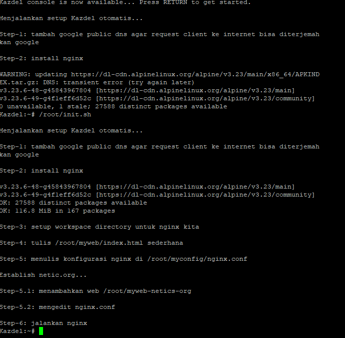

| Name                 | NRP        | Kelas |
| -------------------- | ---------- | ----- |
| Ahmad Fakhrul Bawani | 5025251143 | B051  |

> [!IMPORTANT]
> Remember to use the IP prefix allocation provided earlier for this pre-lab assignment (pra-praktikan) and for future ones.
> Access it on [Linktree](https://linktr.ee/jarkom)

> [!TIP]
> **Due Date : 15th October 2026, 23.00 WIB**

## Put your GNS3 Project files here!

`Put file URL here`

# Tugas Mandiri (Bagian A, B dan C)

> [!IMPORTANT]
> Tugas mandiri ini adalah kelanjutan dari konfigurasi yang telah dikerjakan pada Bagian A hingga C. Pastikan konfigurasi sebelumnya tetap berjalan sebelum mengerjakan tugas mandiri.
>
> _This independent task is a continuation of the configurations performed in Parts A through C. Ensure that the previous configurations remain running before proceeding with the independent task._

#### Soal 1

> Buatlah konfigurasi network seperti yang ada pada soal dengan penambahan node Web3 yang akan digunakan sebagai backend HTTP server baru. Gunakan IP address statis pada subnet yang sama dengan node Web1 dan Web2. Tentukan IP address, subnet mask, dan gateway yang digunakan oleh Web3.
>
> Configure the network for the Web3 node, which will be used as a new HTTP backend server. Use a static IP address within the same subnet as Web1 and Web2. Specify the IP address, subnet mask, and gateway used by Web3.

> [!IMPORTANT]
> Pastikan untuk menunjukkan konfigurasi tiap node, termasuk router, netics-pc-X, web1, web2 dan web3. Ikuti semua langkah yang diberikan pada dokumen soal.
>
> Yang ditunjukkan adalah network configuration, dan service configuration yand ada dalam node tersebut, misal Chernobog adalah DNS server, tunjukkan konfigurasi DNS nya, dan seterusnya.
>
> _Ensure you show the configuration for each node, including the router, netics-pc-X, web1, web2, and web3. Follow all the steps provided in the problem document._
>
> _What is shown is the network configuration and service configuration present on that node, for example, if `Chernobog` is a DNS server, show its DNS configuration, and so on._

**Answer:**

**Router**

1. Ambil netics-pc sebagai router ganti nama dengan `Router` dan hubungkan ke Nat via nat0-eth0.
2. Configure dengan `configure > network configuration > klik edit` atau lewat `nano /ect/network/interfaces` dengan config berikut:

```bash
# biarkan mendapatkan ip dhcp dari nat otomatis
auto eth0
iface eth0 inet dhcp

# set static ip pada eth1 Router untuk client lainnya
auto eth1
iface eth1 inet static
	address 10.127.200.1
	netmask 255.255.255.0

# selalu cek dengan ip -br addr apakah IP address sudah terassignn dengan benar
```

3. Router sekarang dapat terhubung ke internet. Namun Router harus menjalankan tugas sebagai `Data Plane` yaitu forwarding packet, menjadi perantara yang meneruskan paket ke alamat yg sesuai. Ini bisa dilakukan dengan mengaktifkan `ip forwarding`. Lalu Nat menggunakan IP Publik, tetapi topologi menggunakan IP Private lokal, sehingga public IP nat harus disesuaikan/diterjemahkan ke IP private lokal kita. Ini bisa dilakukan dengan `iptables` :

```bash
# install update dan iptables dulu
apk update
apk add iptables

# 1. aktifkan packet forwarding
sysctl -w net.ipv4.ip_forward=1

# 2. aktifkan iptables routing.
# -t nat : menggunakan table NAT.
# -A POSTROUTING : Append POSTROUTING, tandai packet yang akan keluar dari Router dengan rule POSTROUTING chain
# -s 10.127.0.0/16 : hanya terapkan rule pada packet dari source dalam lingkup IP 10.127.0.0/16 saja, selain itu abaikan
# -o eth0 : Outputnya ke eth0, semua aturan/rule diterapkan ke eth0
# -j MASQUERADE : mengganti ip asal dengan ip output yaitu eth0 agar dikenal oleh NAT.
iptables -t nat -A POSTROUTING -s 10.127.0.0/16 -o eth0 -j MASQUERADE
```

<br />

**Switch**

1. Hubungkan Router-switch 1 dengan interface eth1-eth0
2. Hubungkan switch 1-switch 2 dengan interface eth1-eth0
3. Hubungkan switch 1-Kazdel dengan interface eth2-eth0
4. Hubungkan switch 1-Aegir dengan interface eth3-eth0
5. Hubungkan switch 2-Sargon, Iberia, Higashi, Ognisko bertuturut-turut dengan interface eth1-eth0, eth2-eth0, eth3-eth0, eth4-eth0

**Aegir (DHCP Server)**

1. Ambil netics-pc lalu konfigurasikan interface (seperti langkah 2 router) dengan konfigurasi static IP berikut:

```bash
auto lo
iface lo inet loopback

auto eth0
iface eth0 inet static
	address 10.127.200.10
	netmask 255.255.255.0
	gateway 10.127.200.1 # alamat ip gerbang keluar dari local subnet, yaitu alamat IP Router karena Router lah yang terhubung ke NAT.
```

2. Konfigurasi otomatis untuk udhcpd di `/root/init.sh`:

```bash
#!/bin/sh
set -e

echo
echo "Menjalankan setup Aegir otomatis..."
echo

echo
echo "Step-1: tambah google public dns"
echo

echo "nameserver 8.8.8.8" > /etc/resolv.conf

echo
echo "Step-2: menulis konfigurasi udhcpd di /etc/dhcpd.conf"
echo

touch /etc/dhcpd.leases
cat << 'EOF' > /etc/dhcpd.conf
start 10.127.200.100
end 10.127.200.150
max_leases 50
pidfile /etc/dhcpd.pid
lease_file /etc/dhcpd.leases
option subnet 255.255.255.0
option router 10.127.200.1
EOF

echo
echo "Step-3: Jalankan dhcp server di background"
echo

udhcpd -f /etc/dhcpd.conf > /var/log/dhcpd.log 2>&1 &

echo "File log udhcp disimpan di /var/log/dhcpd.log"
echo "Setup selesai"
```

**Kazdel HTTP Server**

1. Ambil netics-server lalu configurasi IP interfacenya seperti ini:

```bash
auto eth0
iface eth0 inet static
	address 10.127.200.11
	netmask 255.255.255.0
	gateway 10.127.200.1
```

2. Tulis skrip setup otomatis di `/root/init.sh`:

```bash
#!/bin/sh

set -e

echo
echo "Menjalankan setup Kazdel otomatis..."
echo

echo "Step-1: tambah google public dns agar request client ke internet bisa diterjemahkan google"
echo

echo "nameserver 8.8.8.8" > /etc/resolv.conf

echo "Step-2: install nginx"
echo
apk update
apk add nginx

echo
echo "Step-3: setup workspace directory untuk nginx kita"
echo
mkdir -p /root/myconfig
mkdir -p /root/myweb
mkdir -p /root/mylogs

echo "Step-4: tulis /root/myweb/index.html sederhana"
echo

cat << 'EOF' > /root/myweb/index.html
<html>
  <head>
    <title>This is my Web in Kazdel</title>
  </head>
  <body>
    <h1>This is my Web in Kazdel</h1>
  </body>
</html>
EOF

echo "Step-5: menulis konfigurasi nginx di /root/myconfig/nginx.conf"
echo

cat << 'EOF' > /root/myconfig/nginx.conf
user root;
worker_processes auto;
worker_cpu_affinity auto;
pid /tmp/nginx.pid;
error_log /root/mylogs/error.log;

events {
    worker_connections 768;
}

http {
    server {
        listen 80;
        server_name _;
        root /root/myweb;
        index index.html;
        location / {
            try_files $uri $uri/ =404;
        }
    }
}
EOF
echo "Step-6: jalankan nginx"
nginx -c /root/myconfig/nginx.conf
```

**Sargon, Iberia, Higashi**

1. Ambil netics-pc lalu configurasikan seperti ini:

```bash
auto eth0
iface eth0 inet dhcp
```

2. Coba curl ke `http://10.127.200.11`

```bash
curl -vL http://10.127.200.11
```

**Ognisko**

1. Ambil netics-pc-desktop dan configurasikan seperti ini:

```bash
auto eth0
iface eth0 inet dhcp
```

2. Coba buka browser dan pergi ke `http://10.127.200.11`.

**Chernobog (DNS Server)**

1. Ambil netics-server dan set config seperti ini:

```bash
auto eth0
iface eth0 inet static
	address 10.127.200.12
	netmask 255.255.255.0
	gateway 10.127.200.1
```

2. Tulis skrip setup otomatis:

```bash
#!/bin/sh

set -e

echo "Menjalankan setup Chernobog otomatis..."
echo

echo "Step-1: membuat workspace directory untuk dns di /root/dns dan /root/dnsdata"
echo

mkdir -p /root/dns
mkdir -p /root/dnsdata

echo "Step-3: tambah google public dns untuk akses internet lalu install bind"
echo
echo "nameserver 8.8.8.8" > /etc/resolv.conf
apk update
apk add bind

echo "Step-4: tulis konfigurasi domain name di /root/dns/named.conf"
cat << 'EOF' > /root/dns/named.conf
options {
    directory "/root/dns";
    listen-on {
        any;
    };
    allow-query {
        any;
    };
};

logging {
    channel default_log {
        file "/root/dns/named.log" versions 3 size 5m;
        severity info;
        print-time yes;
        print-severity yes;
        print-category yes;
    };
    category default {
        default_log;
    };
    category queries {
        default_log;
    };
};

zone "localhost" {
    type master;
    file "db.localhost";
};

zone "netics.my.id" {
    type master;
    file "db.netics.my.id";
};
EOF

echo
echo "Step-5: tulis tabel yang memetakan konfigurasi nama domain"
echo "Menulis /root/dns/db.localhost"
cat << 'EOF' > /root/dns/db.localhost
$TTL 86400
@ IN SOA localhost. root.localhost. (
    1
    3600
    1800
    604800
    86400)

@ IN NS localhost.
@ IN A  127.0.0.1
EOF

echo "Menulis /root/dns/db.netics.my.id"
cat << 'EOF' > /root/dns/db.netics.my.id
$TTL 86400
@ IN SOA ns1.netics.my.id admin.netics.my.id (
    1
    3600
    1800
    604800
    8400)

@   IN  NS  ns1.netics.my.id.
ns1 IN  A   10.127.200.12
www IN  A   10.127.200.11
EOF

echo
echo "Step-6: buat script starter dns server di /root/dns/start_dns.sh"
cat << 'EOF' > /root/dns/start_dns.sh
#!/bin/sh
nohup named -g -c /root/dns/named.conf > /var/log/named.log 2>&1 &
EOF

echo
echo "Step-7: jalankan server dnsnya"
chmod +x /root/dns/start_dns.sh
/root/dns/start_dns.sh

echo "Log file bisa dilihat di /var/log/named.log"
```

3. Buka dhcp server yaitu Aegir dan edit file `/etc/dhcpd.conf` nya:

```bash
# remember this is in Aegir, not Chernobog
cat << 'EOF' >> /root/init.sh
echo "Step-4: tambahkan konfigurasi dns ke /etc/udhcpd.conf"
# matikan udhcpd lama
killall udhcpd 2>/dev/null || true

# tambahkan konfigurasi
echo "option dns 10.127.200.12 8.8.8.8" >> /etc/dhcpd.conf
# nyalakan kembali
udhcpd -f /etc/dhcpd.conf > /var/log/dhcpd.log 2>&1 &
EOF
```

4. Memperluas domain name dengan multizone, caranya edit `/root/init.sh`.

```bash
#!/bin/sh

set -e

echo "Menjalankan setup Chernobog otomatis..."
echo

echo "Step-1: membuat workspace directory untuk dns di /root/dns dan /root/dnsdata"
echo

mkdir -p /root/dns
mkdir -p /root/dnsdata

echo "Step-3: tambah google public dns untuk akses internet lalu install bind"
echo
echo "nameserver 8.8.8.8" > /etc/resolv.conf
apk update
apk add bind

echo "Step-4: tulis konfigurasi domain name di /root/dns/named.conf"
cat << 'EOF' > /root/dns/named.conf
options {
    directory "/root/dns";
    listen-on {
        any;
    };
    allow-query {
        any;
    };
};

logging {
    channel default_log {
        file "/root/dns/named.log" versions 3 size 5m;
        severity info;
        print-time yes;
        print-severity yes;
        print-category yes;
    };
    category default {
        default_log;
    };
    category queries {
        default_log;
    };
};

zone "localhost" {
    type master;
    file "db.localhost";
};

zone "netics.my.id" {
    type master;
    file "db.netics.my.id";
};
EOF

echo
echo "Step-5: tulis tabel yang memetakan konfigurasi nama domain"
echo "Menulis /root/dns/db.localhost"
cat << 'EOF' > /root/dns/db.localhost
$TTL 86400
@ IN SOA localhost. root.localhost. (
    1
    3600
    1800
    604800
    86400)

@ IN NS localhost.
@ IN A  127.0.0.1
EOF

echo "Menulis /root/dns/db.netics.my.id"
cat << 'EOF' > /root/dns/db.netics.my.id
$TTL 86400
@ IN SOA ns1.netics.my.id admin.netics.my.id (
    1
    3600
    1800
    604800
    8400)

@   IN  NS  ns1.netics.my.id.
ns1 IN  A   10.127.200.12
www IN  A   10.127.200.11
EOF

echo "Menambahkan netics.org"
echo "Step-5.1: append zone baru netics.org di /root/dns/named.conf"
echo
cat << 'EOF' >> /root/dns/named.conf
zone "netics.org" {
    type master;
    file "db.netics.org";
};
EOF

echo "Step-5.2: tulis db.netics.org"
echo
cat << 'EOF' > /root/dns/db.netics.org
$TTL 86400
@ IN SOA ns1.netics.org. admin.netics.org. (
    1
    3600
    1800
    604800
    86400)

@   IN NS   ns1.netics.org.
ns1 IN A    10.127.200.12
web IN A    10.127.200.11
EOF

echo
echo "Step-6: buat script starter dns server di /root/dns/start_dns.sh"
cat << 'EOF' > /root/dns/start_dns.sh
#!/bin/sh
nohup named -g -c /root/dns/named.conf > /var/log/named.log 2>&1 &
EOF

echo
echo "Step-7: jalankan server dnsnya"
chmod +x /root/dns/start_dns.sh
/root/dns/start_dns.sh

echo "Log file bisa dilihat di /var/log/named.log"
```

**Kazdel Establish Netics.org**

1. Edit `/root/init.sh` sehingga nginx meladeni web.netics.org

```bash
#!/bin/sh

set -e

echo
echo "Menjalankan setup Kazdel otomatis..."
echo

echo "Step-1: tambah google public dns agar request client ke internet bisa diterjemahkan google"
echo

echo "nameserver 8.8.8.8" > /etc/resolv.conf

echo "Step-2: install nginx"
echo
apk update
apk add nginx

echo
echo "Step-3: setup workspace directory untuk nginx kita"
echo
mkdir -p /root/myconfig
mkdir -p /root/myweb
mkdir -p /root/mylogs

echo "Step-4: tulis /root/myweb/index.html sederhana"
echo

cat << 'EOF' > /root/myweb/index.html
<html>
  <head>
    <title>This is my Web in Kazdel</title>
  </head>
  <body>
    <h1>This is my Web in Kazdel</h1>
  </body>
</html>
EOF

echo "Step-5: menulis konfigurasi nginx di /root/myconfig/nginx.conf"
echo

cat << 'EOF' > /root/myconfig/nginx.conf
user root;
worker_processes auto;
worker_cpu_affinity auto;
pid /tmp/nginx.pid;
error_log /root/mylogs/error.log;

events {
    worker_connections 768;
}

http {
    server {
        listen 80;
        server_name _;
        root /root/myweb;
        index index.html;
        location / {
            try_files $uri $uri/ =404;
        }
    }
}
EOF

echo "Establish netic.org..."
echo

echo "Step-5.1: menambahkan web /root/myweb-netics-org"
echo

mkdir -p /root/myweb-netics-org
cat << 'EOF' > /root/myweb-netics-org/index.html
<html>
  <head>
    <title>netics.org</title>
  </head>
  <body>
    <h1>This is my NETICS-ORG</h1>
  </body>
</html>
EOF

echo "Step-5.2: mengedit nginx.conf"
echo
cat << 'EOF' > /root/myconfig/nginx.conf
user root;
worker_processes auto;
worker_cpu_affinity auto;
pid /tmp/nginx.pid;
error_log /root/mylogs/error.log;

events {
    worker_connections 768;
}

http {
    server {
        listen 80;
        server_name www.netics.my.id;
        root /root/myweb;
        index index.html;
        location / {
            try_files $uri $uri/ =404;
        }
    }
    server {
        listen 80;
        server_name web.netics.org;
        root /root/myweb-netics-org;
        index index.html;
        location / {
            try_files $uri $uri/ =404;
        }
    }
}
EOF

echo "Step-6: jalankan nginx"
nginx -c /root/myconfig/nginx.conf
```

2. Restart nodenya.

**Reverse Proxy**

**Web1**

1. Setup ip-nya:

```bash
auto eth0
iface eth0 inet static
    address 10.127.200.20
    netmask 255.255.255.0
    gateway 10.127.200.1
```

2. Setup script otomatis di `/root/init.sh`

```bash
#!/bin/sh

set -e

echo "Menjalankan setup otomatis..."
echo

echo "Step-1: install nginx"
echo
echo "nameserver 8.8.8.8" > /etc/resolv.conf
apk update
apk add nginx

echo "Step-2: membuat workspace nginx"
echo

mkdir -p /root/myconfig
mkdir -p /root/myweb
mkdir -p /root/mylogs

echo "Step-3: menulis konfigurasi nginx di /root/myconfig/nginx.conf"
echo

cat << 'EOF' > /root/myconfig/nginx.conf
user root;
worker_processes auto;
worker_cpu_affinity auto;
pid /tmp/nginx.pid;
error_log /root/mylogs/error.log;

events {
    worker_connections 768;
}

http {
    server {
        listen 8080;
        server_name _;
        root /root/myweb;
        index index.html;
        location / {
            try_files $uri $uri/ =404;
        }
    }
}
EOF

echo "Step-4: membuat web sederhana..."
echo

cat << 'EOF' > /root/myweb/index.html
<html>
  <head>
    <title>This is my web 1</title>
  </head>
  <body>
    <h1>Ini WEB-1</h1>
  </body>
</html>
EOF

echo "Step-5: jalankan nginx"
nginx -c /root/myconfig/nginx.conf
```

3. Restart nodenya.

**Web2**

1. Setup ip-nya:

```bash
auto eth0
iface eth0 inet static
    address 10.127.200.21
    netmask 255.255.255.0
    gateway 10.127.200.1
```

2. Setup script otomatis di `/root/init.sh`

```bash
#!/bin/sh

set -e

echo "Menjalankan setup otomatis..."
echo

echo "Step-1: install nginx"
echo
echo "nameserver 8.8.8.8" > /etc/resolv.conf
apk update
apk add nginx

echo "Step-2: membuat workspace nginx"
echo

mkdir -p /root/myconfig
mkdir -p /root/myweb
mkdir -p /root/mylogs

echo "Step-3: menulis konfigurasi nginx di /root/myconfig/nginx.conf"
echo

cat << 'EOF' > /root/myconfig/nginx.conf
user root;
worker_processes auto;
worker_cpu_affinity auto;
pid /tmp/nginx.pid;
error_log /root/mylogs/error.log;

events {
    worker_connections 768;
}

http {
    server {
        listen 8080;
        server_name _;
        root /root/myweb;
        index index.html;
        location / {
            try_files $uri $uri/ =404;
        }
    }
}
EOF

echo "Step-4: membuat web sederhana..."
echo

cat << 'EOF' > /root/myweb/index.html
<html>
  <head>
    <title>This is my web 2</title>
  </head>
  <body>
    <h1>Ini WEB-2</h1>
  </body>
</html>
EOF

echo "Step-5: jalankan nginx"
nginx -c /root/myconfig/nginx.conf
```

3. Restart nodenya.

**Kazdel Reverse Proxy**

1. Edit `/root/init.sh` menjadi seperti ini:

```bash
#!/bin/sh

set -e

echo
echo "Menjalankan setup Kazdel otomatis..."
echo

echo "Step-1: tambah google public dns agar request client ke internet bisa diterjemahkan google"
echo

echo "nameserver 8.8.8.8" > /etc/resolv.conf

echo "Step-2: install nginx"
echo
apk update
apk add nginx

echo
echo "Step-3: setup workspace directory untuk nginx kita"
echo
mkdir -p /root/myconfig
mkdir -p /root/myweb
mkdir -p /root/mylogs

echo "Step-4: tulis /root/myweb/index.html sederhana"
echo

cat << 'EOF' > /root/myweb/index.html
<html>
  <head>
    <title>This is my Web in Kazdel</title>
  </head>
  <body>
    <h1>This is my Web in Kazdel</h1>
  </body>
</html>
EOF

echo "Step-5: menulis konfigurasi nginx di /root/myconfig/nginx.conf"
echo

cat << 'EOF' > /root/myconfig/nginx.conf
user root;
worker_processes auto;
worker_cpu_affinity auto;
pid /tmp/nginx.pid;
error_log /root/mylogs/error.log;

events {
    worker_connections 768;
}

http {
    server {
        listen 80;
        server_name _;
        root /root/myweb;
        index index.html;
        location / {
            try_files $uri $uri/ =404;
        }
    }
}
EOF

echo "Establish netic.org..."
echo

echo "Step-5.1: menambahkan web /root/myweb-netics-org"
echo

mkdir -p /root/myweb-netics-org
cat << 'EOF' > /root/myweb-netics-org/index.html
<html>
  <head>
    <title>netics.org</title>
  </head>
  <body>
    <h1>This is my NETICS-ORG</h1>
  </body>
</html>
EOF

echo "Step-5.2: mengedit nginx.conf"
echo
cat << 'EOF' > /root/myconfig/nginx.conf
user root;
worker_processes auto;
worker_cpu_affinity auto;
pid /tmp/nginx.pid;
error_log /root/mylogs/error.log;

events {
    worker_connections 768;
}

http {
    server {
        listen 80;
        server_name www.netics.my.id;
        root /root/myweb;
        index index.html;
        location / {
            try_files $uri $uri/ =404;
        }
        location = /Web1 {
            proxy_pass http://10.127.200.20:8080/;
            proxy_set_header Host $host;
            proxy_set_header X-Real-IP $remote_addr;
        }
        location = /Web2 {
            proxy_pass http://10.127.200.21:8080/;
            proxy_set_header Host $host;
            proxy_set_header X-Real-IP $remote_addr;
        }
    }
    server {
        listen 80;
        server_name web.netics.org;
        root /root/myweb-netics-org;
        index index.html;
        location / {
            try_files $uri $uri/ =404;
        }
    }
}
EOF

echo "Step-6: jalankan nginx"
nginx -c /root/myconfig/nginx.conf
```

2. Restart nodenya.

**Calendar App pada Web2**

1. Tambahkan script `/root/calendar-app.init.sh` untuk generate calendar app. Jalankan sekali saja

```bash
#!/bin/sh

set -e

echo "Melakukan generate calendar app otomatis..."
echo

echo "Step-1: install python3"
echo
echo "nameserver 8.8.8.8" > /etc/resolv.conf
apk update
apk add python3

echo
echo "Step-2: generate app..."
echo

mkdir -p /root/aplikasi
cat << 'EOF' > /root/aplikasi/program.py
import calendar
from datetime import datetime
from http.server import BaseHTTPRequestHandler, HTTPServer

PORT = 5000

class CalendarRequestHandler(BaseHTTPRequestHandler):
    def do_GET(self):
        now = datetime.now()
        year = now.year
        month = now.month

        cal = calendar.Calendar(firstweekday=6)
        month_days = cal.monthdayscalendar(year, month)
        month_name = calendar.month_name[month]

        html = \
        f"""
        <!doctype html>
        <html lang="en">
        <head>
            <meta charset="UTF-8" />
            <meta name="viewport" content="width=device-width, initial-scale=1.0" />
            <title>{month_name} {year} - Calendar</title>
            <style>
                body {{
                    font-family: -apple-system, BlinkMacSystemFont, "Segoe UI", Roboto, sans-serif;
                    background-color: #f4f7f6;
                    display: flex;
                    justify-content: center;
                    align-items: center;
                    height: 100vh;
                    margin: 0;
                }}
                .calendar-container {{
                    background: #ffffff;
                    padding: 24px;
                    border-radius: 12px;
                    box-shadow: 0 4px 20px rgba(0,0,0,0.8);
                    width: 100%;
                    max-width: 500px;
                }}
                h2 {{
                    text-align: center;
                    color: #2c3e50;
                    margin-top: 0;
                    margin-bottom: 20px;
                }}
                table {{
                    width: 100%;
                    border-collapse: collapse;
                }}
                th {{
                    background-color: #3498db;
                    color: white;
                    font-weight: 600;
                    padding: 12px 0;
                    width: 14.28%;
                    border-radius: 4px;
                }}
                td {{
                    text-align: center;
                    padding: 16px 0;
                    color: #333;
                    font-size: 16px;
                    font-weight: 500;
                }}
                .today {{
                    background-color: #e8f4fd;
                    color: #3498db;
                    border-radius: 50%;
                    font-weight: bold;
                }}
                .empty {{
                    color: #ccc;
                }}
            </style>
        </head>
        <body>
            <div class="calendar-container">
                <h2>{month_name} {year}</h2>
                <table>
                    <thead>
                        <tr>
                            <th>Sun</th>
                            <th>Mon</th>
                            <th>Tue</th>
                            <th>Wed</th>
                            <th>Thu</th>
                            <th>Fri</th>
                            <th>Sat</th>
                        </tr>
                    </thead>
                    <tbody>
        """
        for week in month_days:
            html += f"<tr>"
            for day in week:
                if day == 0:
                    html += f'<td class="empty">&bull;</td>'
                elif day == now.day:
                    html += f'<td class="today">{day}</td>'
                else:
                    html += f"<td>{day}</td>"
            html += f"</tr>"
        html += \
        f"""
                    </tbody>
                </table>
            </div>
        </body>
        </html>
        """
        self.send_response(200)
        self.send_header("Content-type", "text/html")
        self.end_headers()
        self.wfile.write(html.encode("utf-8"))

def run():
    server_address = ("", PORT)
    httpd = HTTPServer(server_address, CalendarRequestHandler)
    print(f"Server running at http://localhost:{PORT}")
    try:
        httpd.serve_forever()
    except KeyboardInterrupt:
        print("\nServer stopped.")

if __name__ == "__main__":
    run()
EOF

echo "Setup berhasil, harap nyalakan ulang..."
```

2. Edit `/root/init.sh` agar menjalankan dan meladeni aplikasi python.

```bash
#!/bin/sh

set -e

echo "Menjalankan setup otomatis..."
echo

echo "Step-1: install nginx"
echo
echo "nameserver 8.8.8.8" > /etc/resolv.conf
apk update
apk add nginx

echo "Step-2: membuat workspace nginx"
echo

mkdir -p /root/myconfig
mkdir -p /root/myweb
mkdir -p /root/mylogs

echo "Step-3: menulis konfigurasi nginx di /root/myconfig/nginx.conf"
echo

cat << 'EOF' > /root/myconfig/nginx.conf
user root;
worker_processes auto;
worker_cpu_affinity auto;
pid /tmp/nginx.pid;
error_log /root/mylogs/error.log;

events {
    worker_connections 768;
}

http {
    server {
        listen 8080;
        server_name _;
        root /root/myweb;
        index index.html;
        location / {
            try_files $uri $uri/ =404;
        }
    }
}
EOF

echo "Step-4: membuat web sederhana..."
echo

cat << 'EOF' > /root/myweb/index.html
<html>
  <head>
    <title>This is my web 2</title>
  </head>
  <body>
    <h1>Ini WEB-2</h1>
  </body>
</html>
EOF

echo "Step-5.1: jalankan nginx"
nginx -c /root/myconfig/nginx.conf

echo "Step-5.2: Jalankan calendar app"
python3 /root/aplikasi/program.py
```

3. Restart nodenya.

**Kazdel Reverse Proxy Add /App Endpoint**

1. Edit konfigurasi `/root/init.sh` agar meladeni endpoint `/app` seperti ini

```bash
#!/bin/sh

set -e

echo
echo "Menjalankan setup Kazdel otomatis..."
echo

echo "Step-1: tambah google public dns agar request client ke internet bisa diterjemahkan google"
echo

echo "nameserver 8.8.8.8" > /etc/resolv.conf

echo "Step-2: install nginx"
echo
apk update
apk add nginx

echo
echo "Step-3: setup workspace directory untuk nginx kita"
echo
mkdir -p /root/myconfig
mkdir -p /root/myweb
mkdir -p /root/mylogs

echo "Step-4: tulis /root/myweb/index.html sederhana"
echo

cat << 'EOF' > /root/myweb/index.html
<html>
  <head>
    <title>This is my Web in Kazdel</title>
  </head>
  <body>
    <h1>This is my Web in Kazdel</h1>
  </body>
</html>
EOF

echo "Step-5: menulis konfigurasi nginx di /root/myconfig/nginx.conf"
echo

cat << 'EOF' > /root/myconfig/nginx.conf
user root;
worker_processes auto;
worker_cpu_affinity auto;
pid /tmp/nginx.pid;
error_log /root/mylogs/error.log;

events {
    worker_connections 768;
}

http {
    server {
        listen 80;
        server_name _;
        root /root/myweb;
        index index.html;
        location / {
            try_files $uri $uri/ =404;
        }
    }
}
EOF

echo "Establish netic.org..."
echo

echo "Step-5.1: menambahkan web /root/myweb-netics-org"
echo

mkdir -p /root/myweb-netics-org
cat << 'EOF' > /root/myweb-netics-org/index.html
<html>
  <head>
    <title>netics.org</title>
  </head>
  <body>
    <h1>This is my NETICS-ORG</h1>
  </body>
</html>
EOF

echo "Step-5.2: mengedit nginx.conf"
echo
cat << 'EOF' > /root/myconfig/nginx.conf
user root;
worker_processes auto;
worker_cpu_affinity auto;
pid /tmp/nginx.pid;
error_log /root/mylogs/error.log;

events {
    worker_connections 768;
}

http {
    server {
        listen 80;
        server_name www.netics.my.id;
        root /root/myweb;
        index index.html;
        location / {
            try_files $uri $uri/ =404;
        }
        location = /Web1 {
            proxy_pass http://10.127.200.20:8080/;
            proxy_set_header Host $host;
            proxy_set_header X-Real-IP $remote_addr;
        }
        location = /Web2 {
            proxy_pass http://10.127.200.21:8080/;
            proxy_set_header Host $host;
            proxy_set_header X-Real-IP $remote_addr;
        }
        location = /app {
            proxy_pass http://10.127.200.21:5000/;
            proxy_set_header Host $host;
            proxy_set_header X-Real-IP $remote_addr;
        }
    }
    server {
        listen 80;
        server_name web.netics.org;
        root /root/myweb-netics-org;
        index index.html;
        location / {
            try_files $uri $uri/ =404;
        }
    }
}
EOF

echo "Step-6: jalankan nginx"
nginx -c /root/myconfig/nginx.conf
```

2. Restart nodenya.

#### Soal 2

> Install dan konfigurasi nginx pada Web3 sebagai HTTP server backend, mengikuti langkah yang sama seperti pada Web1 (netics-pc-8) dan Web2 (netics-pc-9) di Bagian C: install nginx, lalu buat struktur direktori konfigurasi (`/root/myconfig`), web (`/root/myweb`), dan log (`/root/mylogs`) seperti yang digunakan pada Bagian A. Tunjukkan juga ulang konfigurasi nginx serta struktur direktori yang sudah ada pada Web1 dan Web2 sebagai pembanding/verifikasi bahwa keduanya tetap konsisten dengan Web3.
>
> _Install and configure nginx on Web3 as an HTTP backend server, following the same steps used for Web1 (netics-pc-8) and Web2 (netics-pc-9) in Part C: install nginx, then create the configuration (`/root/myconfig`), web (`/root/myweb`), and log (`/root/mylogs`) directory structure used in Part A. Also show the existing nginx configuration and directory structure on Web1 and Web2 as a comparison/verification that they remain consistent with Web3._

**Answer:**

```
put your answer here (and screenshot)
```

#### Soal 3

> Buatlah halaman `index.html` pada Web3 yang memiliki isi berbeda dari Web1 (berisi "Ini WEB-1") dan Web2 (berisi "Ini WEB-2") sehingga dapat digunakan untuk membuktikan bahwa request berhasil diteruskan ke Web3.
>
> _Create an `index.html` page on Web3 with content different from Web1 (which contains "Ini WEB-1") and Web2 (which contains "Ini WEB-2") so that it can be used to prove that requests are successfully forwarded to Web3._

**Answer:**

```
put your answer here (and screenshot)
```

#### Soal 4

> Konfigurasikan nginx pada Web3 agar HTTP server berjalan pada port `8080` (sama seperti Web1 dan Web2). Jelaskan konfigurasi `listen`, `server_name`, `root`, `index`, dan `location` yang digunakan.
> Kemudian buktikan bahwa HTTP server pada Web3 dapat diakses secara langsung dari client menggunakan alamat IP dan port `8080`. Gunakan `curl` untuk melakukan pengujian.
>
> _Configure nginx on Web3 so that the HTTP server runs on port `8080` (the same as Web1 and Web2). Explain the purpose of the `listen`, `server_name`, `root`, `index`, and `location` directives used in the configuration._
> _Then, prove that the HTTP server on Web3 can be accessed directly from a client using its IP address and port `8080`. Use `curl` to perform the test._

**Answer:**

```
put your answer here (and screenshot)
```

#### Soal 5

> Konfigurasikan reverse proxy pada `Kazdel` (yang sudah memiliki blok `location` untuk `/web1` menuju Web1 dan `/web2` menuju Web2) agar request ke `http://www.netics.my.id/web3` diteruskan ke Web3 melalui port `8080`, dengan menambahkan blok `location` baru pada `nginx.conf` tanpa mengganggu konfigurasi `/web1`, `/web2`, dan `/app` yang sudah ada.
>
> _Configure the reverse proxy on `Kazdel` (which already has `location` blocks for `/web1` pointing to Web1 and `/web2` pointing to Web2) so that requests to `http://www.netics.my.id/web3` are forwarded to Web3 through port `8080`, by adding a new `location` block in `nginx.conf` without disrupting the existing `/web1`, `/web2`, and `/app` configuration._

**Answer:**

```
put your answer here (and screenshot)
```

#### Soal 6

> Buktikan bahwa Web3 dapat diakses melalui reverse proxy menggunakan:
>
> `curl http://www.netics.my.id/web3`
>
> Pastikan response yang diterima menunjukkan isi halaman dari Web3, dan tunjukkan juga bahwa endpoint `/web1` dan `/web2` yang sudah ada sebelumnya tetap berfungsi normal setelah penambahan `/web3`.
>
> _Prove that Web3 can be accessed through the reverse proxy using:_
>
> `curl http://www.netics.my.id/web3`
>
> _Make sure that the received response contains the page content served by Web3, and also show that the pre-existing `/web1` and `/web2` endpoints still work normally after adding `/web3`._

**Answer:**

```
put your answer here (and screenshot)
```

#### Soal 7

> Tambahkan record DNS baru untuk domain `app.netics.my.id` pada DNS server (Chernobog, zona `netics.my.id`). Domain tersebut harus mengarah ke IP address reverse proxy `Kazdel` ([IP Prefix].200.11), bukan langsung ke Web3.
> Buktikan bahwa `app.netics.my.id` berhasil di-resolve oleh client menggunakan DNS server internal. Gunakan `ping` atau command DNS yang tersedia untuk menunjukkan hasil resolusi.
>
> _Add a new DNS record for `app.netics.my.id` on the DNS server (Chernobog, zone `netics.my.id`). The domain must point to the IP address of the reverse proxy `Kazdel` ([IP Prefix].200.11), not directly to Web3._
> _Prove that `app.netics.my.id` can be successfully resolved by the client using the internal DNS server. Use `ping` or an available DNS command to show the resolution result._

**Answer:**

```
put your answer here (and screenshot)
```

#### Soal 8

> Konfigurasikan nginx pada `Kazdel` agar `app.netics.my.id` dapat digunakan sebagai name-based virtual host. Request ke domain tersebut harus diteruskan ke Web3.
> Buktikan bahwa `app.netics.my.id` dapat digunakan untuk mengakses Web3 melalui reverse proxy menggunakan `curl`.
>
> _Configure nginx on `Kazdel` so that `app.netics.my.id` can be used as a name-based virtual host. Requests to this domain must be forwarded to Web3._
> _Prove that `app.netics.my.id` can be used to access Web3 through the reverse proxy using `curl`._

**Answer:**

```
put your answer here (and screenshot)
```

#### Soal 9

> Buktikan bahwa endpoint berikut menghasilkan backend yang sesuai:
>
> - `http://www.netics.my.id/web1` -> Web1
> - `http://www.netics.my.id/web2` -> Web2
> - `http://www.netics.my.id/app` -> Flask pada Web2
> - `http://www.netics.my.id/web3` -> Web3
> - `http://app.netics.my.id/` -> Web3
>
> _Prove that each of the following endpoints reaches the correct backend:_
>
> - `http://www.netics.my.id/web1` -> Web1
> - `http://www.netics.my.id/web2` -> Web2
> - `http://www.netics.my.id/app` -> Flask on Web2
> - `http://www.netics.my.id/web3` -> Web3
> - `http://app.netics.my.id/` -> Web3

**Answer:**

```
put your answer here (and screenshot)
```

#### Soal 10

> Konfigurasikan dan jalankan `termshark` dan nginx reverse-proxy secara bersamaan menggunakan `tmux` untuk menangkap traffic HTTP ketika client mengakses Web3 melalui reverse proxy (Kazdel).
> Gunakan `termshark` untuk mengamati request HTTP yang diterima oleh Web3. Identifikasi source IP, destination IP, source port, destination port, dan informasi HTTP yang terdapat pada packet.
>
> _Configure and run `termshark` and the nginx reverse proxy simultaneously using `tmux` to capture HTTP traffic when a client accesses Web3 via the reverse proxy (Kazdel)._
> _Use `termshark` to observe the HTTP request received by Web3. Identify the source IP, destination IP, source port, destination port, and HTTP information contained in the packet._

**Answer:**

```
put your answer here (and screenshot)
```

#### Soal 11

> Lakukan pengujian akses Web3 melalui reverse proxy dari minimal dua client yang berbeda, misalnya `Sargon` dan `Iberia`. Amati nilai `X-Real-IP` pada masing-masing request menggunakan `termshark`.
>
> Buktikan bahwa header `X-Real-IP` diteruskan oleh reverse proxy kepada Web3. Tunjukkan nilai `X-Real-IP` yang diterima oleh Web3.
> Bandingkan source IP pada packet yang diterima Web3 dengan nilai `X-Real-IP`. Apakah keduanya sama? Jelaskan mengapa nilai tersebut dapat berbeda.
>
> _Test access to Web3 through the reverse proxy from at least two different clients, such as `Sargon` and `Iberia`. Observe the `X-Real-IP` value for each request using `termshark`._
>
> _Prove that the `X-Real-IP` header is forwarded by the reverse proxy to Web3. Show the value of `X-Real-IP` received by Web3._
> _Compare the source IP address of the packet received by Web3 with the value of `X-Real-IP`. Are they the same? Explain why the two values may be different._

**Answer:**

```
put your answer here (and screenshot)
```

#### Soal 12

> Buatlah kesimpulan mengenai arsitektur yang telah dibuat. Jelaskan hubungan antara DNS server, reverse proxy, Web1, Web2, aplikasi Flask, dan Web3. Jelaskan juga bagaimana request dari client dapat mencapai backend yang berbeda menggunakan satu reverse proxy.
>
> _Write a conclusion about the architecture you have implemented. Explain the relationship between the DNS server, reverse proxy, Web1, Web2, the Flask application, and Web3. Also explain how client requests can reach different backends through a single reverse proxy._

**Answer:**

```
put your answer here (or additionally screenshot)
```

#### Kendala

1. Concurrent install membuat salah satu node gagal install.



#### Troubleshooting

1. GNS3 `409 conflict, container 'xxxx' is already in use...`. Solution:
   - Go to GNS VM, in main menu click `OK` or `enter`
   - Go to Shell
   - Check any docker container:

   ```bash
   docker ps -a
   ```

   - Delete that container in `container 'xxxx' is already in use...`.
   - Or just delete all of them, but this will restart Router and reinstalling kea-dhcp4 in Aegir:

   ```bash
   docker system prune
   ```

<br />

2. Running script in `init.sh` cannot be stopped and always turn off the node. Solution: Restart by `configure > reset` and make sure to not run any foreground process anymore in init.sh.

<br />
AJK
